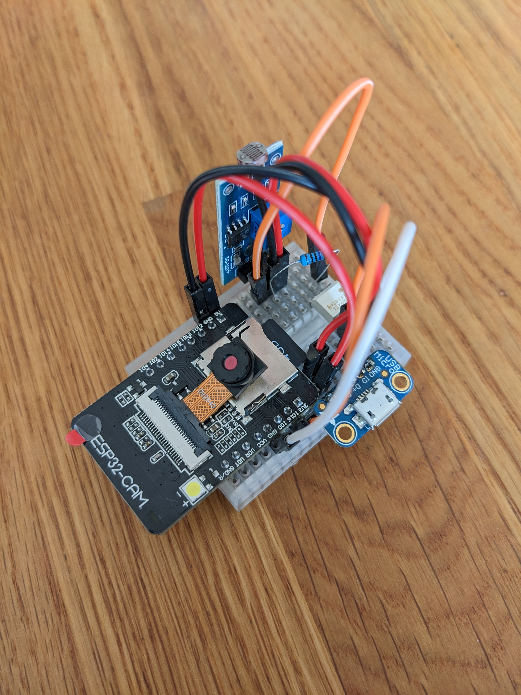
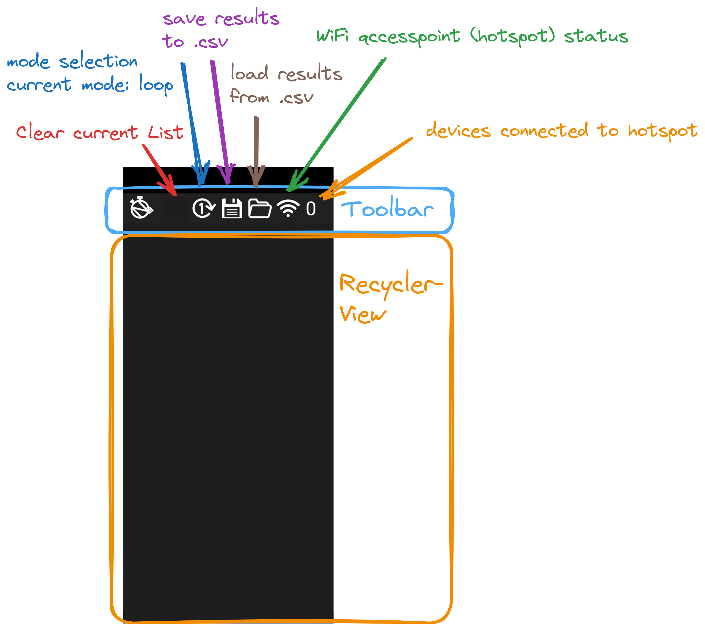
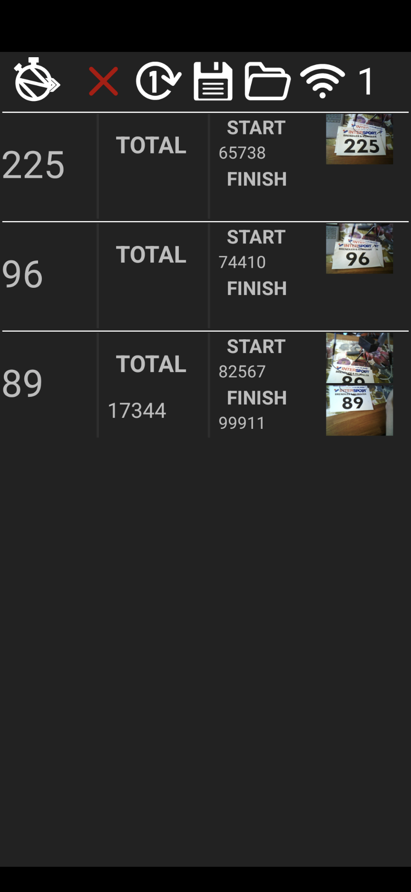

oNbeat
==========================

Introduction
------------

ONbeat project is about developing an accurate and affordable timing system for Pumptrack and Enduro bike races. The name oNbeat is derived from the English word offbeat in the sense that the system is unconventional while replacing the prefix with oN implies the accuracy of the system. The unconventional detail about the timing system is that it uses a photoelectric barrier for timing combined with a camera enhanced with AI to identify the participant by his or her race number instead of the standard RFID-based timing. Identifying the participants is done on a microcontroller capturing the image to reduce network traffic and ensure functionality in case of network disconnects. Thus, the ESP32 microcontroller, a cheap but performant hardware that is capable of running small machine learning models is chosen for the timing system. In use, the microcontroller communicates for setup and data analysis purposes with an Android smartphone via WiFi. As a common network, a WiFi hotspot must be hosted by the smartphone. A custom Android app works as the user interface for the whole timing system, which guides the user through the setup process and collects and visualizes the data, once the timing system is set up properly.

Requirements
--------------

Android Device/Emulator API 33+

Installation
--------------

At the moment oNbeat is not provided via Google Play Store, so just clone the repository, create an .apk file and install it on your phone. Another option is cloning the repository and running the app via Android Studio while the phone is connected to the PC.

Run Instructions
--------------
1. Be sure to have at least one ESP32, looking as follows:

3. Disconnect from mobile network and WiFi on your phone
4. Open oNbeat. The toolbar works as follows:

6. Start Hotspot
7. Connect ESP32 (if two ESP32 are used, the ESP32 at the start line) to a power source
8. Connect the second ESP32 - OR - change from track mode to loop mode by clicking on the respective image
9. Enjoy the race!

